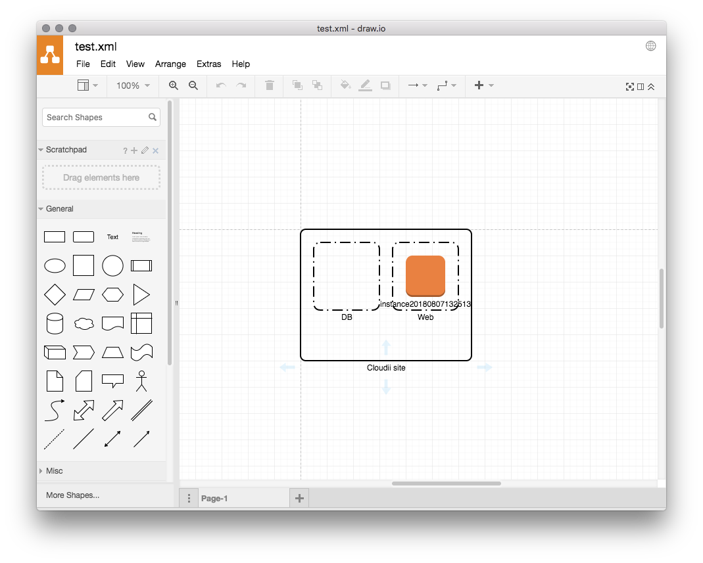

# oci-diagram

Mapping out an [Oracle Cloud Infrastructure (OCI)](https://cloud.oracle.com/cloud-infrastructure) network is easy with oci-diagram.

This tool outputs in [JGraph / mxGraph](https://github.com/jgraph) format and can be used with [draw.io](https://www.draw.io/) etc.

## Supported services

- [x] VCN
- [x] Subnet
- [x] Instance
- [ ] All other :expressionless:


## Usage

```
$ oci-diagram --config-file ~/.oci/config \
    --compartment-id <CompartmentId> \
    --out test.xml
```

or

```
$ oci-diagram --tenancy <Tenancy> \
    --compartment-id <CompartmentId> \
    --region <Region>
    --user <UserId>
    --fingerprint <FingerPrint>
    --privatekey <PrivateKeyPath>
    --out test.xml
```




---

Inspired by Lucidchart or Cacoo...

* https://www.lucidchart.com/pages/integrations/aws-architecture-import
* https://cacoo.com/ja/blog/aws-architecture-import/

